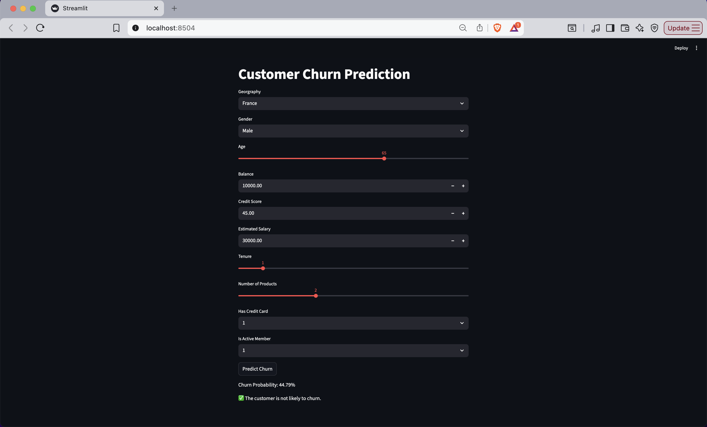
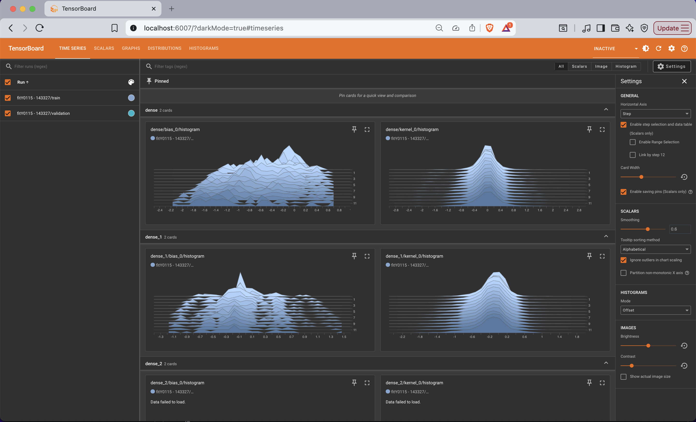

 ANN Classification – Customer Churn Modelling (Streamlit)

 **Project Overview**

This project implements an Artificial Neural Network (ANN) to predict customer churn in a banking scenario and deploys the trained model as an interactive Streamlit web application. The system predicts whether a customer is likely to leave the bank based on demographic and financial attributes.

The project covers the entire machine learning lifecycle — from data preprocessing and model training to deployment and real-time inference.

**Problem Statement**

Customer churn is a major concern for banks and financial institutions. Retaining existing customers is often more cost-effective than acquiring new ones.

This project aims to:
Predict customer churn accurately and help businesses take preventive actions based on model predictions

**Dataset & Features**

The dataset contains customer-related information such as:
Credit Score,Geography,Gender ,Age ,Tenure ,Balance, Number of Products , Has Credit Card ,Is Active Member, Estimated Salary ,Target variable: Exited (0 or 1) — whether the customer churned

 **Data Preprocessing**

The following preprocessing steps were performed:

Label Encoding for binary categorical features ,One-Hot Encoding for multi-class categorical variables (Geography) , Feature Scaling using StandardScaler , Splitting data into training and testing sets ,All preprocessing objects were saved to ensure consistent predictions during deployment.

**Model Architecture (ANN) **

Built using TensorFlow/Keras , Multiple Dense layers with ReLU activation , Sigmoid output layer for binary classification. Optimized using:
Binary Crossentropy loss , Adam optimizer. The model was trained and evaluated for performance on unseen data.

 **Deployment with Streamlit**

The trained ANN model was deployed using Streamlit: User-friendly UI for entering customer details with Real-time churn prediction it reuses saved model and preprocessing objects .This makes the project practical and usable beyond notebooks.

**Tech Stack**

Python , NumPy, Pandas , Scikit-learn , TensorFlow / Keras ,Streamlit

**Key Learnings**

* End-to-end ML pipeline implementation

* ANN model building and evaluation

* Model serialization and reuse

* Deploying ML models as web applications

## Project Screenshots for Streamlit and the Tensorboard

##ANN Regression 
At end i performed regression to predict continuous values from input features. The model is trained using TensorFlow/Keras with proper preprocessing, feature scaling, and evaluation.

